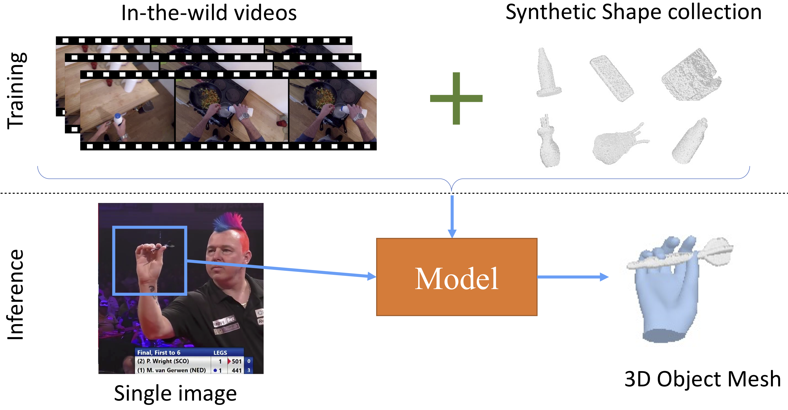

# 3D Reconstruction of Objects in Hands without Real World 3D Supervision

## [Project Page](https://ap229997.github.io/projects/wild-hoi/) | [Paper](https://ap229997.github.io/projects/wild-hoi/assets/paper.pdf) | [Supplementary](https://ap229997.github.io/projects/wild-hoi/assets/suppmat.pdf) | [Video](https://youtu.be/LaoPL0jV25w) | [Poster](https://ap229997.github.io/projects/wild-hoi/assets/poster.pdf)

 

This repository contains the code for the ECCV 2024 paper [3D Reconstruction of Objects in Hands without Real World 3D Supervision](https://ap229997.github.io/projects/wild-hoi/assets/paper.pdf). If you find our code or paper useful, please cite
```bibtex
@inproceedings{Prakash2024HOI,
    author = {Prakash, Aditya and Chang, Matthew and Jin, Matthew and Tu, Ruisen and Gupta, Saurabh},
    title = {3D Reconstruction of Objects in Hands without Real World 3D Supervision},
    booktitle = {European Conference on Computer Vision (ECCV)},
    year = {2024}
}
```

## Setup

Follow the instructions in [IHOI](https://github.com/JudyYe/ihoi/blob/main/docs/install.md) to setup the environment and external dependencies.

## Dataset

We use several datasets in our work, download the RGB images, segmentation masks, object masks and hand poses (if available) separately for each: [ObMan](https://www.di.ens.fr/willow/research/obman/data/), [HO3D](https://www.tugraz.at/institute/icg/research/team-lepetit/research-projects/hand-object-3d-pose-annotation/), [MOW](https://zhec.github.io/rhoi/), [VISOR](https://epic-kitchens.github.io/VISOR/).

The object meshes are processed using DeepSDF code into the required format in the same way as [IHOI](https://github.com/JudyYe/ihoi/blob/main/docs/preprocess.md). For ObMan and HO3D, we use the `mesh_sdf` from [IHOI](https://github.com/JudyYe/ihoi/blob/main/docs/preprocess.md). For HOI4D and MOW, it is recommended to run the DeepSDF code on the object meshes and save in the same format as ObMan and HO3D in the `mesh_sdf` folder.

We have also provided our preprocessed data [here](https://drive.google.com/drive/folders/1WyCVKuhfieY2qkY4vso_TBTKrbJ_GjFU?usp=sharing). These can directly be used with the RGB images and segmentation masks from the respective datasets.

We also curate multiview sequences of diverse objects from VISOR, referred to as WildObjectsinHands, which is available [here](https://drive.google.com/drive/folders/14uzyoI8Xl5lPAAKiF6YIbtotXilrdudi?usp=sharing). The `Hands.pkl` file from the drive is the same as `visor_train.pkl` in the preprocessed data. These do not have any ground truth object mesh.

After downloading the data, update the paths in `experiments/*.yaml` configs. The data structure should be as follows:
```
data
├── cache
├── mesh_sdf
├── obman
│   ... # ObMan data
├── ho3d
│   ... # HO3D data
├── mow
│   ... # MOW data
├── visor
│   ... # VISOR data from WildObjectsinHands  
```

## Training

All models are initialized from ObMan pretrained checkpoint, it can be downloaded from [here](https://drive.google.com/drive/folders/1WyCVKuhfieY2qkY4vso_TBTKrbJ_GjFU?usp=sharing).

Our models are trained jointly on multiple datasets, using different forms of supervision as available, check `experiments/combined.yaml` for details.
```bash
python models/ihoi.py --config experiments/combined.yaml  --ckpt <PATH_TO_OBMAN_CKPT>
```

Training with discriminator requires `xsecs_center_planes.npz` which is available in the preprocessed data above.


## Evaluation

To evaluate the model on the test set, run the following command:
```bash
python models/ihoi.py --config experiments/test.yaml --ckpt <PATH_TO_TRAINED_CKPT> --eval
```

## Acknowledgements

This codebase is built on top of the awesome [IHOI](https://github.com/JudyYe/ihoi/tree/main) repo. We thank all the authors of the datasets used in our work for making them publicly available. Check out their works as well.